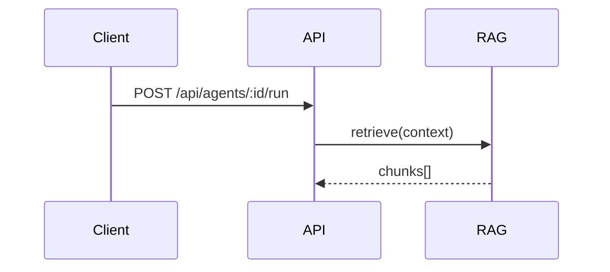

<!--
Branch policy (CLAUDE.md, "Branching and Pull Requests") — read before submitting:

- Branch off `dev`, and target `dev` with every pull request. `main` is the released
  branch, kept as a fast-forward of `dev`. Never open a backport pull request to
  `main`: anything merged to `dev` reaches it at the next sync.
- The repository's default branch is `main`, so the GitHub UI and `gh pr create`
  will target it unless told otherwise. Check the base branch above this box.
- `Fixes #N` does NOT close the issue. GitHub honours closing keywords only when a
  pull request merges into the default branch, so a `dev` merge closes nothing.
  Close linked issues by hand.

Description format — write for a reader who has not followed the branch:
  1. What breaks, what triggers it, and how it behaves after the change.
  2. One or two views of the mechanism, whichever make it reviewable: a focused
     diff, a call tree, a shallow file tree, or a Mermaid sequence. Keep only the
     calls, files and state the change actually carries.
  3. Describe the code as it stands. Do not narrate what earlier commits tried or
     what a review round changed. Naming the merged pull request that caused a bug
     is different — that is history the reader needs.
-->

## What this changes

<!-- What breaks today, what triggers it, and how it behaves after the change. -->

## Mechanism

<!--
One or two views only. Mermaid is rendered by GitHub:

-->

## How this was verified

<!--
Focused tests you ran and their results, plus `npx tsc --noEmit` in every workspace
you touched. Name the checks you could not run instead of implying coverage.
-->

- [ ] Focused tests pass
- [ ] `npx tsc --noEmit` run in every workspace I changed
- [ ] `npm run sort-imports -- <the files I touched>`
- [ ] `npm run static-checks:full -- --against origin/dev`
- [ ] The pull request targets `dev`

## Checklist

- [ ] Observable behavior is covered, not just the reported path: loading, empty,
      success, failure, cancellation, retry, restored session, as applicable
- [ ] No backend capability left without a frontend entry point
- [ ] Visible strings localized through `useLocalize()`; semantic HTML, keyboard
      behavior and ARIA intact
- [ ] New code in `/api` is wiring only — behavior lives in `packages/api`
- [ ] New database types live in `packages/data-schemas`; no Mongoose types in the
      exported signatures of `packages/api`, `packages/data-provider` or `client`
- [ ] New levers are configurable through `configSchema` in
      `packages/data-provider/src/config.ts`, defaulting to today's behavior
- [ ] Auth user document cache invalidated for affected user mutations
- [ ] Existing defaults, stored data and configuration compatibility preserved

## Linked issues

<!-- `Fixes #N` will not close these on a `dev` merge — close them by hand. -->
